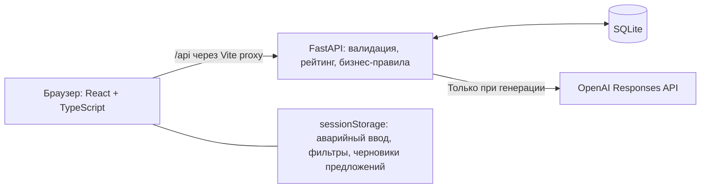

# AI Sana Challenge Hub

AI Sana Challenge Hub помогает бизнесу превращать практические проблемы в понятные проекты для студенческих команд. ИИ уточняет требования и предлагает структуру задачи, а бизнес проверяет карточку, публикует её и вручную выбирает предложения студентов. Проект разработан для **HackAlem AI, трек №7 «Образование»**.

## Доступность проекта

В репозитории не указан адрес публичной deployed-версии. **Проект доступен для локального запуска по инструкции ниже.** Адреса `127.0.0.1` в этом документе относятся только к приложению на вашем компьютере.

[Репозиторий на GitHub](https://github.com/BAITC-Hacks/hack-aa81a7d5-dark-and-darker) · [Запуск](#быстрый-запуск) · [Демонстрация для жюри](#демонстрация-для-жюри) · [Тестирование](#тестирование)

## Проблема

Бизнесу бывает сложно описать задачу так, чтобы студенты поняли контекст, доступные данные и ожидаемый результат. Студентам, в свою очередь, не хватает реальных проектов, на которых можно применить знания и получить опыт взаимодействия с заказчиком. Неполные требования затрудняют первый разговор между сторонами.

## Решение

Платформа соединяет бизнес с командами студентов через каталог практических задач. Конструктор помогает заказчику последовательно описать проблему, а OpenAI API формирует уточняющие вопросы и предлагает редакцию карточки. Студенты изучают опубликованные задачи и отправляют свои предложения; решение о сотрудничестве принимает представитель бизнеса.

## Основные возможности

- Создание бизнес-задачи в пошаговом конструкторе.
- Генерация семи индивидуальных вопросов через OpenAI API.
- Формирование структурированной карточки из ответов пользователя.
- Сравнение исходных ответов с AI-редакцией, выбор варианта и ручные правки.
- Ручное подтверждение актуальной версии карточки.
- Рейтинг готовности от 0 до 100 с критериями и рекомендациями.
- Публикация подтверждённой задачи независимо от рейтинга, включая 0 баллов.
- Каталог задач с поиском, фильтрами и сортировкой.
- Профили студенческих команд и выбор демонстрационной команды.
- Отправка предложений и просмотр их статусов.
- Ручное принятие и отклонение предложений бизнесом.
- Сохранение задач, состояния конструктора и отправленных предложений в SQLite.
- Автосохранение, восстановление конструктора и защита от конфликтов между вкладками.

## Как работает платформа

**Бизнес описывает проблему → ИИ уточняет требования → формируется карточка → бизнес подтверждает и публикует задачу → студенты отправляют предложения → бизнес выбирает исполнителя.**

Роли **Бизнес / Студент** переключаются в шапке приложения. Это демонстрационные режимы: создавать отдельные аккаунты для прохождения сценария не нужно.

## AI-функциональность

OpenAI Responses API используется в двух действиях конструктора:

1. По названию и первоначальному описанию генерируются семь вопросов о требованиях к проекту.
2. По исходной идее, вопросам и ответам формируется карточка из девяти полей: название, описание и семь разделов требований.

ИИ вызывается по действиям пользователя. Возврат между заполненными шагами не запускает новую генерацию; для неё есть отдельные кнопки.

**Рейтинг рассчитывает детерминированный алгоритм backend, а не нейросеть.** Он оценивает заполненность семи разделов. ИИ не подтверждает карточку, не публикует задачу и не принимает предложения вместо пользователя.

Исходные ответы сохраняются отдельно. Смысловые изменения предлагаются для ручной проверки; автоматически допускаются только ограниченные изменения форматирования. Пользователь видит, что сейчас используется: **исходный ответ, AI-редакция или ручная правка**. Выбор текста не подтверждает всю карточку.

Без настроенного OpenAI или при ошибке API работает резервный режим: семь стандартных вопросов и карточка из введённых ответов. Пройти сценарий до публикации и принятия предложения можно без ключа.

## Технологический стек

| Часть | Технологии |
| --- | --- |
| Frontend | TypeScript, React 19.3, Vite 8.3, CSS, `fetch` |
| Backend | Python, FastAPI 0.141.1, Pydantic 2.13.5, Uvicorn, `python-dotenv` |
| Database | SQLite через стандартный модуль `sqlite3` |
| AI | OpenAI Responses API, официальный Python SDK 3.19.0; `gpt-5.4` в `backend/.env.example`, модель настраивается через `OPENAI_MODEL` |
| Testing | Playwright; backend-тесты на `unittest`, HTTP-проверки и mock OpenAI |

Проверенная среда: **macOS, Node.js 22.22.1, npm 10.9.4, Python 3.14.3**. В `package.json` требуется Node.js не ниже 22.12.0. Зависимости зафиксированы в [package-lock.json](package-lock.json) и [backend/requirements.txt](backend/requirements.txt); backend запускается из локального `.venv`.

## Быстрый запуск

Команды ниже рассчитаны на macOS/Linux. Установите Node.js с npm и Python; для воспроизведения проверенной среды используйте Python 3.14.3. Команда `python3` должна указывать на нужный интерпретатор. Глобальная установка зависимостей проекта не требуется.

1. Клонируйте репозиторий:

   ```sh
   git clone https://github.com/BAITC-Hacks/hack-aa81a7d5-dark-and-darker.git HackAlem
   ```

2. Перейдите в папку проекта:

   ```sh
   cd HackAlem
   ```

3. Создайте виртуальное окружение Python:

   ```sh
   python3 -m venv .venv
   ```

4. Установите backend-зависимости:

   ```sh
   .venv/bin/python -m pip install -r backend/requirements.txt
   ```

5. Установите frontend-зависимости:

   ```sh
   npm ci
   ```

6. Создайте локальный файл настроек, сохранив существующий, если он уже есть:

   ```sh
   test -f backend/.env || cp backend/.env.example backend/.env
   ```

   В `backend/.env` заполните `OPENAI_API_KEY` собственным ключом, если нужна генерация через OpenAI. Образец содержит пустой ключ и выбранную модель:

   ```dotenv
   OPENAI_API_KEY=
   OPENAI_MODEL=gpt-5.4
   ```

   С пустым ключом приложение работает в резервном режиме. Настройки читает только backend; не помещайте ключ в frontend или переменные `VITE_`. После изменения `.env` перезапустите backend.

7. Запустите backend из корня проекта в первом терминале:

   ```sh
   npm run dev:backend
   ```

8. Откройте второй терминал в корне проекта и запустите frontend:

   ```sh
   npm run dev
   ```

Откройте **http://127.0.0.1:5173**. Схема базы и демонстрационные данные создаются автоматически при запуске backend.

- Swagger UI: http://127.0.0.1:8000/docs
- Проверка доступности backend: http://127.0.0.1:8000/api/health
- Остановка каждого сервера: `Ctrl+C` в его терминале.

Если проект уже клонирован и зависимости установлены, начните с настройки `.env` и запуска серверов. Если порт занят, остановите ранее запущенный сервер.

## Демонстрация для жюри

Сценарий занимает около **3–5 минут**. Заранее запустите оба сервера. Для демонстрации живой генерации настройте OpenAI; при резервном режиме интерфейс явно сообщает об этом.

| Время | Действие | Что показать |
| --- | --- | --- |
| 0:00–0:40 | В роли **Бизнес** нажмите **Создать задачу** | Название «Демо: анализ отзывов» и описание «Нам нужен веб-сервис для анализа отзывов» |
| 0:40–1:20 | Нажмите **Далее**, дождитесь вопросов ИИ | Уточнения по контексту, данным, результату и другим критериям; ответьте на несколько вопросов |
| 1:20–2:15 | Нажмите **Сформировать карточку**, откройте сравнение | Исходные ответы, AI-предложения и индикатор выбранного варианта; при наличии различий переключите текст |
| 2:15–2:45 | Перейдите к правкам и подтвердите карточку | Рейтинг, критерии и рекомендации; рейтинг показывает полноту, а не качество решения |
| 2:45–3:10 | Нажмите **Опубликовать** | Даже неполная карточка доступна для публикации после подтверждения |
| 3:10–4:00 | Переключитесь на **Студент**, найдите задачу в каталоге | Выберите команду, заполните сообщение и предлагаемое решение, отправьте предложение |
| 4:00–5:00 | Вернитесь в роль **Бизнес**, откройте предложение и нажмите **Принять** | Решение принимает человек; в режиме студента статус меняется на «Принято» |

Воспроизводимый пример входных данных для шага уточнений:

| Поле | Что ввести |
| --- | --- |
| Контекст и потребность | Отзывы клиентов разбираем вручную; хотим быстрее находить повторяющиеся проблемы. |
| Ожидаемый результат | Прототип веб-сервиса, который группирует отзывы по темам. |
| Остальные пять ответов | Оставьте пустыми. |
| Сообщение в предложении студента | Готовы обсудить задачу и подготовить прототип. |
| Предлагаемое решение | Уточним категории отзывов, реализуем группировку и покажем результат на панели. |

Ожидаемый результат: после подтверждения рейтинг равен **35** (20 за контекст и 15 за результат), задача публикуется и появляется в студенческом каталоге. После отправки предложение имеет статус **«На рассмотрении»**, после решения бизнеса — **«Принято»**. Этот сценарий доступен и без OpenAI; тогда вместо AI-редакции используется исходный текст. Для отдельной проверки публикации с **0 баллов** оставьте пустыми все семь ответов и вручную подтвердите карточку.

## Данные и интеграции

| Источник | Как используется |
| --- | --- |
| Ввод бизнеса | Название, описание и ответы становятся основой карточки и AI-запросов. |
| Ввод студента | Сообщение и предлагаемое решение сохраняются как предложение команды. |
| Локальный seed | Создаёт вымышленные задачи, команды и предложения для демонстрации. |
| OpenAI API | Единственный подключённый внешний сервис приложения: генерирует вопросы и редакцию карточки. |
| SQLite | Хранит задачи, состояние конструктора, команды, отправленные предложения и решения бизнеса. |

Упоминания CSV, отзывов или данных датчиков в демонстрационных карточках — описания предполагаемых материалов заказчика, а не подключённые датасеты. Загрузка файлов и интеграции с CRM, почтой или внешними базами не реализованы. Для новых задач источником фактов служат ответы пользователя; seed в генерацию не подставляется. Своё обучение AI-модели проект не выполняет.

### Демонстрационные данные

[Seed](backend/app/seed.py) на новой базе автоматически создаёт:

| Данные | Количество |
| --- | ---: |
| Первоначальные черновики | 5 |
| Опубликованные карточки | 5 |
| Студенческие команды | 5 |
| Предложения | 7 |

Предложения включают 3 ожидающих решения, 2 принятых и 2 отклонённых. Демонстрационный бизнес — **Sana Business Lab**, представитель — Айдана Садыкова. Опубликованные задачи посвящены отзывам клиентов, прогнозированию спроса, доставке, обработке заявок и энергопотреблению; их рейтинги — 100, 75, 55, 30 и 10.

Seed выполняется в транзакции и отмечает запуск как `demo-v1` в `seed_runs`. Повторный запуск не создаёт дубликаты, не удаляет и не перезаписывает пользовательские данные.

При необходимости seed можно вызвать явно из корня проекта:

```sh
npm run seed
```

Не удаляйте `backend/hackalem.db`, если нужно сохранить работу: задачи и предложения остаются в ней между перезапусками.

## Тестирование

Результаты полного прогона, выполненного **23 сентября 2026 года** перед обновлением этого README:

| Проверка | Результат |
| --- | --- |
| Backend | **34 теста прошли** |
| Playwright | **39 тестов прошли** |
| Production-сборка | Успешно |
| TypeScript | Без ошибок |
| `git diff --check` | Без ошибок |

Все перечисленные проверки выполнены на текущем коде. Тесты использовали временные базы и mock OpenAI; живая генерация в этом прогоне не проверялась.

Команды из корня проекта:

```sh
npm run test:backend
npx playwright install chromium
npm run test:e2e
npm run build
./node_modules/.bin/tsc --noEmit
git diff --check
```

`npx playwright install chromium` нужен один раз для установки тестового браузера после `npm ci`; Playwright уже является локальной зависимостью проекта.

Backend-тесты используют `unittest`, временные SQLite-базы и локальный HTTP-сервер на свободном порту. Они проверяют все 128 комбинаций рейтинга, seed и миграции, валидацию, поиск, публикацию с 0 баллов, подтверждение, предложения, перезапуск сервера и повтор операций сохранения.

Playwright автоматически поднимает отдельные серверы на портах **5174 и 8001**. Скрипт [scripts/test-e2e.mjs](scripts/test-e2e.mjs) создаёт отдельную временную базу и удаляет её после проверки. Запускайте браузерные тесты через `npm run test:e2e`, чтобы сохранить эту изоляцию.

Покрыты полный сценарий бизнеса и студента, поздние AI-ответы, две вкладки и HTTP 409, быстрый возврат к оригиналу во время сохранения, потеря ответа сервера, тайм-аут, выход без сохранения, восстановление после обновления, отсутствие дубликатов, фильтры и черновики предложений. Состояние сохранённых задач проверяется через API, читающий SQLite.

AI-тесты используют mock-ответы SDK, mock HTTP transport и перехват браузерных запросов. У тестовых серверов `OPENAI_API_KEY` и `OPENAI_MODEL` явно пустые; реальные запросы OpenAI не выполняются. Проверяются схема Responses API, ошибки и резервный режим, сохранение исходных ответов и проверка AI-редакций. `httpx2` устанавливается как зависимость официального SDK.

Адаптивность проверена в **Chromium** на ширинах **320, 375, 390, 768 и 1440 px**, включая полный сценарий на 320 px. Это браузерная проверка размеров окна, **не тестирование физических устройств iOS или Android**. Скриншоты и диагностические артефакты находятся в `test-results/`.

Тестовые серверы не используют основную базу. Отдельно запущенный `npm run dev:backend` работает с `--reload`: при редактировании backend он может перезапуститься и применить миграции к своей базе. Если при разработке требуется сохранить основную базу неизменной, заранее остановите этот сервер или запустите его с отдельным `HACKALEM_DB_PATH`.

## Архитектура и API



В режиме локальной разработки React обращается к FastAPI через `/api`. Vite проксирует запросы на `http://127.0.0.1:8000`; отдельная настройка CORS для этого сценария не нужна. Backend валидирует данные, выполняет транзакции SQLite и рассчитывает рейтинг. AI-endpoints возвращают текст, а сохранение, подтверждение и публикация выполняются отдельными запросами после действий пользователя. API-ключ остаётся на backend.

### Структура проекта

```text
backend/app/main.py              REST API и переходы состояний
backend/app/ai.py                OpenAI Responses API и резервный режим
backend/app/ai_models.py         Структуры AI-запросов и ответов
backend/app/ai_checks.py         Проверка вопросов и сравнение редакций
backend/app/config.py            Чтение backend/.env
backend/app/db.py                SQLite, транзакции и схема
backend/app/models.py            Валидация входных данных
backend/app/wizard_models.py     Состояние конструктора и операции сохранения
backend/app/readiness.py         Рейтинг и стандартные вопросы
backend/app/seed.py              Демонстрационные данные
backend/tests/                  Backend-тесты и mock OpenAI
frontend/src/App.tsx             Роли, навигация и уведомления
frontend/src/main.tsx            Точка входа React
frontend/src/api.ts              HTTP-запросы и загрузка данных
frontend/src/ai.ts               AI-запросы и локальный резерв
frontend/src/context.tsx         Общий UI-контекст
frontend/src/navigation.tsx      Защита навигации и диалог выхода
frontend/src/wizardDraft.ts      Автосохранение и восстановление конструктора
frontend/src/catalogFilters.ts   Фильтры отдельно для каждой роли
frontend/src/types.ts            Типы данных
frontend/src/components/         Каталог, карточка, конструктор, команды, предложения
frontend/src/styles.css          Адаптивный интерфейс
frontend/tests/                  Сквозные и регрессионные Playwright-тесты
scripts/test-e2e.mjs             Изоляция базы браузерных тестов
playwright.config.ts            Настройки Playwright
vite.config.ts                  Vite, сборка и API-прокси
```

### Основные endpoints

Полные схемы запросов и ответов доступны в Swagger UI по `/docs`.

| Метод | Путь | Назначение |
| --- | --- | --- |
| GET | `/api/health` | Доступность backend |
| GET | `/api/questions` | Стандартные вопросы и веса критериев |
| POST | `/api/ai/questions` | Индивидуальные вопросы или резервный набор |
| POST | `/api/ai/task-card` | Карточка и сравнение AI-редакции либо резервная карточка |
| GET | `/api/tasks` | Каталог с поиском, фильтрами и сортировкой |
| GET | `/api/tasks/{id}` | Карточка, ревизия и состояние конструктора |
| POST | `/api/tasks` | Создание черновика, HTTP 201 |
| PATCH | `/api/tasks/{id}` | Изменение полей карточки |
| POST | `/api/wizard-drafts` | Создание или возврат черновика по `client_id` |
| PUT | `/api/tasks/{id}/wizard` | Сохранение состояния конструктора |
| POST | `/api/tasks/{id}/confirm` | Ручное подтверждение версии |
| POST | `/api/tasks/{id}/publish` | Публикация подтверждённой версии |
| GET | `/api/tasks/{id}/readiness` | Рейтинг, критерии и рекомендации |
| GET | `/api/teams` | Список команд |
| GET | `/api/teams/{id}` | Профиль команды |
| POST | `/api/tasks/{id}/proposals` | Отправка предложения, HTTP 201 |
| GET | `/api/tasks/{id}/proposals` | Предложения по задаче |
| GET | `/api/teams/{id}/proposals` | Предложения выбранной команды |
| GET | `/api/proposals` | Все предложения демонстрационному бизнесу |
| PATCH | `/api/proposals/{id}/status` | Ручное решение по предложению |

Параметры `GET /api/tasks`:

- `status`: `draft` или `published`.
- `readiness_level`: `Черновик`, `Рабочая`, `Готовая`, `Приоритетная`.
- `sort`: `newest`, `oldest`, `score_desc`, `score_asc`.
- `search`: поиск по названию и описанию без учёта регистра, включая русский.
- `business_id`: фильтр по владельцу; демонстрационный бизнес имеет ID 1.

Основные ошибки: **404** — объект не найден; **422** — неверные входные данные; **409** — конфликт версии или состояния, неподтверждённая публикация, повторное предложение или решение; **403** — попытка изменения задачи другого бизнеса. Проверка владельца не заменяет авторизацию, которой в MVP нет.

### Сохранение конструктора и проверка версий

После заполнения названия и описания автосохранение с задержкой **800 мс** создаёт черновик и заменяет маршрут на `#new/<ID>`. SQLite хранит текущий шаг, первоначальную идею, вопросы, исходные ответы, редактируемую карточку и сравнение последней генерации. При обновлении продолжается работа с тем же черновиком. Повтор создания использует тот же UUID `client_id`, поэтому потерянный ответ не создаёт второй экземпляр задачи. Старые задачи без состояния конструктора открываются на шаге редактирования карточки.

Записи выполняются последовательно. После успешного запроса клиент сравнивает последнее локальное состояние с подтверждённым сервером и сохраняет оставшиеся изменения. Быстрый выбор AI-редакции с возвратом к оригиналу не оставляет на сервере прежний вариант. При совпадении состояний лишняя запись не отправляется. Ожидание сохранения ограничено **30 секундами**; при ошибке ввод остаётся доступным для повторной попытки, бесконечных автоматических повторов нет.

Изменение карточки, сохранение конструктора, подтверждение и публикация требуют `expected_revision` — положительную целую ревизию просмотренной задачи. Проверка и запись происходят в одной транзакции. Без версии возвращается 422; устаревшая операция получает 409 и не перезаписывает новые данные. Интерфейс предлагает открыть актуальную карточку. Её загрузка не подтверждает новую версию автоматически.

Для `PUT /api/tasks/{id}/wizard` клиент также передаёт UUID `operation_id`. Таблица `wizard_save_receipts` хранит одну последнюю квитанцию на задачу: идентификатор, хеш запроса и результирующую ревизию. Точный повтор после потери ответа возвращает уже сохранённый результат **только пока эта ревизия и состояние остаются актуальными**. Изменённое тело запроса или последующее изменение задачи приводит к 409. Это исключение для подтверждённого повтора собственной операции, а не отключение проверки версий. После восстановления результата более свежий локальный ввод сохраняется отдельной операцией.

Проверки ревизии и локального состояния защищают ручной ввод от поздних AI-ответов. При уходе из конструктора запросы отменяются через `AbortController`; поздний ответ не обновляет закрытый компонент.

При смене раздела, роли и переходе браузера назад несохранённая форма предлагает **«Сохранить и выйти»**, **«Продолжить редактирование»**, **«Выйти без сохранения»**. Сохранённая форма не показывает лишний диалог. Выход без сохранения ждёт текущую запись не более **одной секунды**, затем отменяет клиентский запрос и прекращает автосохранение. Отмена HTTP не гарантирует отмены записи в SQLite: уже сохранённые данные не откатываются и черновик не удаляется.

При обновлении или закрытии страницы используется стандартный `beforeunload`. Аварийная копия в `sessionStorage` помогает восстановить ввод до завершения записи, включая правки после потерянного ответа. Основное состояние хранится на backend; резервная копия не должна заменять более новую версию из другой вкладки. История всех прошлых генераций не ведётся.

При запуске backend добавляет недостающую ревизию задач и служебные таблицы `wizard_states` и `wizard_save_receipts`, сохраняя существующие задачи, предложения и историю seed.

### Проверка AI-редакций

Новые вопросы должны содержать все семь критериев ровно по одному и непустые формулировки. Проверка одинаковых и близких вопросов игнорирует регистр, пунктуацию, нумерацию и слово «пожалуйста»; для длинных формулировок используется порог сходства 0,85. Некорректный набор заменяется стандартным без повторного запроса OpenAI. Ранее сохранённые вопросы остаются совместимыми.

Каждое поле карточки сравнивается со своим источником. Пустые ответы остаются пустыми; сведения не переносятся в них автоматически из описания. Контакт сохраняется точно. Если модель стёрла непустой ответ, backend восстанавливает его. Новые числа, утрата неопределённости и удаление сведений получают предупреждения.

Автоматически допускаются только узкие изменения форматирования: пробелы, регистр и однозначная запись того же числа в том же контексте. Например, `100 000` и `100000`, `1,50` и `1.5` могут считаться эквивалентными. Порядок чисел, единицы, отрицания и контекст учитываются: «2 дня» и «2 недели» не приравниваются. Неоднозначные записи вроде `100,000`, даты и пересчёт единиц требуют ручного просмотра. Остальные редакции остаются предложениями, пока человек их не выберет.

На шагах 3 и 4 раздел **«Исходные ответы и редакция AI»** показывает источник, предложенный текст, предупреждения и текущий вариант. Выбранный текст выделен, повторное применение отключено. После нажатия появляется **«AI-редакция применена»** или **«Исходный ответ восстановлен»**. При совпадении текстов отдельная кнопка AI не показывается. Индикатор варианта определяется по текущему содержимому, поэтому восстанавливается вместе с карточкой из SQLite. Выбор текста не подтверждает карточку; подтверждение остаётся отдельным действием.

В ответе генерации может присутствовать `review` с полями `original`, `proposed`, `requires_review`, `warnings`; сравнение сохраняется в `wizard_state.cardReview`. В резервном ответе предложений AI нет. Лексическая проверка вопросов может пропустить смысловые дубликаты или дать ложное совпадение. Структурированный JSON и локальные проверки не доказывают достоверность текста — проверка смысла остаётся за человеком.

### Рейтинг, публикация и предложения

| Критерий | Баллы |
| --- | ---: |
| Контекст и потребность | 20 |
| Данные и материалы | 20 |
| Ожидаемый результат | 15 |
| Критерии успеха | 15 |
| Ограничения | 10 |
| Пользователи | 10 |
| Связь с бизнесом | 10 |

Непустой после удаления крайних пробелов раздел получает весь вес, пустой — 0. Название и краткое описание баллов не добавляют. Уровни: **0–39 — «Черновик»**, **40–69 — «Рабочая»**, **70–89 — «Готовая»**, **90–100 — «Приоритетная»**. Уровень рейтинга и статус публикации — разные характеристики.

Публикация доступна после ручного подтверждения текущей версии, **в том числе с 0 баллов**. Сохранение изменений полей сбрасывает подтверждение и возвращает опубликованную задачу в черновик. Сохранение тех же значений подтверждение не сбрасывает. После правок нужны повторное подтверждение и публикация; уже отправленные предложения сохраняются.

Команда может отправить одно предложение на задачу. Оно получает статус `pending`. Бизнес вручную меняет его на `accepted` или `rejected`; обработанное предложение нельзя обработать повторно или вернуть в `pending`. Принятие одного предложения не отклоняет остальные автоматически.

### Роли, фильтры и локальные черновики

Роль и выбранная команда запоминаются в `localStorage`. Студенческий каталог показывает опубликованные задачи; бизнес видит свои задачи и входящие предложения. Выбор команды доступен через её профиль, форму предложения и раздел «Мои предложения».

Незавершённые предложения хранятся в `sessionStorage` отдельно для пары **«задача + команда»**. Переключение команды, повторное открытие задачи и обновление страницы в той же вкладке восстанавливают текст. Ошибка отправки сохраняет ввод; успех очищает только отправленный черновик. Автоматической отправки нет. Отправленные предложения и решения бизнеса хранятся в SQLite.

Поиск, уровень готовности, сортировка и бизнес-фильтр статуса сохраняются отдельно для каждой роли (`sana-catalog:business`, `sana-catalog:student`). Возврат из карточки и переход между разделами восстанавливают настройки. Некорректные значения заменяются стандартными; **«Сбросить фильтры»** очищает настройки текущей роли. `sessionStorage` не предназначен для постоянного хранения после закрытия вкладки.

### Настройка OpenAI и резервный режим

Настройки читаются через `python-dotenv` только из `backend/.env`. Переменные окружения процесса имеют приоритет, включая явно пустые значения. Настройки кэшируются: после изменения ключа или модели перезапустите backend. Модель берётся из `OPENAI_MODEL`; образец задаёт `gpt-5.4`. Недоступная модель не заменяется другой автоматически.

Используется `client.responses.parse(..., text_format=PydanticModel)` с JSON-схемой, `store=False`, тайм-аутом **45 секунд**, `max_retries=0`, лимитом **6 000 выходных токенов** и reasoning effort `low`. Браузер ожидает AI-endpoint максимум **55 секунд**, затем использует локальный резерв. В OpenAI передаются введённые для генерации название, описание, вопросы и ответы; ключ остаётся на backend и не включается в prompts или ответы приложения.

AI-endpoints не сохраняют и не публикуют задачи самостоятельно:

- `/api/ai/questions`: вход — `title`, `initial_description`; ответ — семь объектов `field`, `question`, а также `source`, `reason`, `message`.
- `/api/ai/task-card`: вход — `title`, `initial_description`, `questions`, `answers` с семью строковыми полями; ответ — `card` из девяти полей, необязательное `review`, `source`, `reason`, `message`. Пустые ответы передаются как `""`.
- Невалидный запрос возвращает **422**. Сбой OpenAI возвращает **200 с резервным результатом** и `source="fallback"`; успешная генерация — `source="ai"`.
- Причины резервного режима: `missing_api_key`, `missing_model`, `authentication`, `model_unavailable`, `rate_limit`, `timeout`, `connection`, `invalid_response`, `provider_error`.

Интерфейс сообщает **«Включён резервный режим»**. Исходная ошибка провайдера и секреты не возвращаются пользователю. При ошибке авторизации проверьте локальный ключ и доступ проекта OpenAI; при `model_unavailable` — доступ к выбранной модели. После изменения настроек перезапустите backend. Резервный режим сохраняет возможность завершить работу.

`backend/.env` исключён из Git. Проверка без вывода содержимого:

```sh
git check-ignore -v backend/.env
git ls-files -- backend/.env
```

Вторая команда не должна выводить путей. Не добавляйте файл через `git add -f`.

### Дополнительные команды запуска

Backend без npm, из корня проекта:

```sh
.venv/bin/python -m uvicorn backend.app.main:app --reload --reload-dir backend --host 127.0.0.1 --port 8000
```

Отдельная SQLite-база для локальных экспериментов:

```sh
HACKALEM_DB_PATH=backend/demo-sandbox.db npm run dev:backend
```

Путь считается от рабочей папки процесса; каталог назначения должен существовать. Базы `*.db`, их служебные файлы, `.env`, `.venv`, `node_modules`, результаты сборки и тестов исключены через `.gitignore`.

Локальный просмотр production-сборки frontend:

```sh
npm run build
npm run preview
```

Откройте http://127.0.0.1:4173. Backend должен работать отдельно. `preview` служит для локальной проверки сборки и не превращает MVP в готовое публичное развёртывание.

## Ограничения MVP

- Регистрация и авторизация не реализованы; роли и выбор команд демонстрационные.
- Приложение предназначено для локальной демонстрации с одним бизнесом.
- Для публичного развёртывания нужны авторизация, проверка доступа и дополнительная настройка безопасности.
- Нет загрузки файлов, отправки писем, пагинации и автоматического назначения исполнителей. Контакты представлены текстом.
- Конфликты редактирования обнаруживаются, но автоматического объединения правок нет.
- ИИ и рейтинг не заменяют проверку требований человеком; история всех прошлых AI-генераций не хранится.

Это работающий MVP для хакатона, а не готовый production-продукт.
